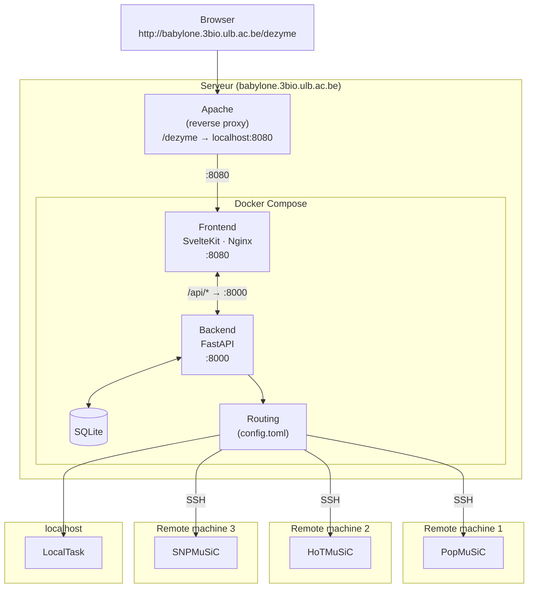

# Dezyme

Web interface for protein mutation analysis tools: **PopMuSiC**, **HoTMuSiC**, **SNPMuSiC** and others.

- **Frontend**: SvelteKit + Vite + Tailwind CSS
- **Backend**: FastAPI (Python 3.12), SQLite, SSH jobs on remote machines

---

## Requirements

- [Docker](https://docs.docker.com/get-docker/) + Docker Compose v2

---

## Configuration (required before first start)

### 1. `backend/config.toml`

Copy the example and fill in the SSH credentials for each tool:

```bash
cp backend/config.toml.example backend/config.toml
```

```toml
[popmusic]
host      = "spitzberg.example.com"
user      = "myuser"
root_path = "/data/analyses/popmusic"

# repeat for hotmusic, snpmusic, etc.
```

To run a tool locally (no SSH), set `host = "localhost"` — `user` is then ignored.

### 2. `backend/.env`

```bash
cp backend/.env.example backend/.env   # if the file doesn't exist, create an empty .env
```

| Variable       | Default                    | Description                                          |
|----------------|----------------------------|------------------------------------------------------|
| `ROOT_PATH`    | `""`                       | FastAPI root path — set to `/dezyme` behind Apache   |
| `SSH_KEY_PATH` | `/tmp/.ssh/id_dezyme`      | Path to the SSH private key inside the container     |

---

## Sysadmin deployment guide

Step-by-step instructions to deploy Dezyme on a server running Apache.

### 1. Install dependencies

```bash
# Docker
curl -fsSL https://get.docker.com | sh

# Add your user to the docker group (log out and back in after)
sudo usermod -aG docker $USER

# Docker Compose plugin (included with recent Docker installs — verify)
docker compose version
```

Enable required Apache modules:

```bash
sudo a2enmod proxy proxy_http proxy_wstunnel
sudo systemctl restart apache2
```

### 2. Create a dedicated user

```bash
sudo useradd -m -s /bin/bash dezyme
sudo su - dezyme
```

All following steps run as the `dezyme` user unless stated otherwise.

### 3. Generate an SSH key pair

This key will be used by the backend to connect to remote machines running the analysis tools.

```bash
ssh-keygen -t ed25519 -C "dezyme" -f ~/.ssh/id_dezyme
# Leave passphrase empty (required for unattended use)
```

Copy the public key to each remote machine:

```bash
ssh-copy-id -i ~/.ssh/id_dezyme.pub user@remote-machine-1
ssh-copy-id -i ~/.ssh/id_dezyme.pub user@remote-machine-2
# repeat for each machine
```

Verify each connection works without a password prompt:

```bash
ssh -i ~/.ssh/id_dezyme user@remote-machine-1 "echo OK"
```

### 4. Clone the repository

This is an umbrella repo — `frontend/` and `backend/` are git submodules. Clone with:

```bash
git clone --recurse-submodules git@github.com:Benoitdw/dezyme.git ~/dezyme
cd ~/dezyme
```

If you already cloned without `--recurse-submodules`:

```bash
git submodule update --init --recursive
```

### 5. Configure `backend/config.toml`

```bash
cp backend/config.toml.example backend/config.toml
```

Edit `backend/config.toml` and fill in one section per tool:

```toml
[popmusic]
host      = "remote-machine-1"
user      = "myuser"
root_path = "/data/analyses/popmusic"

[hotmusic]
host      = "remote-machine-2"
user      = "myuser"
root_path = "/data/analyses/hotmusic"

# For a locally-running tool (no SSH):
[localtask]
host      = "localhost"
root_path = "/data/analyses/localtask"
```

### 6. Configure `backend/.env`

```bash
cp backend/.env.example backend/.env
```

Open `backend/.env` and set:

```env
ROOT_PATH=/dezyme
SSH_KEY_PATH=/tmp/.ssh/id_dezyme
```

`ROOT_PATH` tells FastAPI that the app is served behind a `/dezyme` prefix. `SSH_KEY_PATH` is the path to the SSH private key **inside the container** — Docker Compose mounts `~/.ssh` as read-only at `/run/ssh`, and the container entrypoint copies it to `/tmp/.ssh` with the correct permissions at startup.

### 7. Configure Apache

Create a new virtual host config or add to an existing one:

```apache
# /etc/apache2/sites-available/dezyme.conf  (or inside your existing VirtualHost)

ProxyPreserveHost On

# Frontend (SvelteKit / Nginx)
ProxyPass        /dezyme http://localhost:8080/dezyme
ProxyPassReverse /dezyme http://localhost:8080/dezyme
```

Enable and reload:

```bash
sudo a2ensite dezyme.conf   # skip if added to an existing VirtualHost
sudo systemctl reload apache2
```

### 8. Start the stack

`UID` and `GID` are bash built-ins but are **not** exported to child processes by default — Docker Compose needs them to build the backend image with the right user. Add the export to your shell profile so it persists:

```bash
echo 'export UID GID' >> ~/.bashrc   # or ~/.profile / ~/.zshrc
source ~/.bashrc
```

Then start the stack:

```bash
cd ~/dezyme
mkdir -p backend/data
docker-compose up --build -d
```

Check that both containers are running:

```bash
docker-compose ps
```

Check the logs if something looks wrong:

```bash
docker-compose logs -f
```

The application should now be available at `http://babylone.3bio.ulb.ac.be/dezyme`.

### 9. Auto-start on boot (systemd)

```bash
sudo nano /etc/systemd/system/dezyme.service
```

```ini
[Unit]
Description=Dezyme Docker Compose stack
Requires=docker.service
After=docker.service

[Service]
User=dezyme
WorkingDirectory=/home/dezyme/dezyme
ExecStart=/usr/bin/docker compose up --build
ExecStop=/usr/bin/docker compose down
Restart=on-failure

[Install]
WantedBy=multi-user.target
```

```bash
sudo systemctl daemon-reload
sudo systemctl enable dezyme
sudo systemctl start dezyme
```

### 10. Stopping and updating

```bash
cd ~/dezyme

# Stop
docker compose down

# Pull latest code (umbrella + submodules) and restart
git pull --recurse-submodules
docker compose up --build -d
```

---

## Production deployment

```bash
docker compose up --build -d
```

| Service  | URL                        |
|----------|----------------------------|
| Frontend | http://localhost:8080       |
| Backend  | http://localhost:8000/docs  |

Nginx serves the static SvelteKit build and proxies `/api/*` to the backend.

To stop:

```bash
docker compose down
```

---

## Development mode

Dev mode mounts the source code into the containers and enables automatic reloading — no rebuild needed on every change.

```bash
docker compose -f docker-compose.dev.yml up --build
```

| Service  | URL                         | Reloading              |
|----------|-----------------------------|------------------------|
| Frontend | http://localhost:5173        | Vite HMR (instant)     |
| Backend  | http://localhost:8000/docs   | uvicorn `--reload`     |

**Live-mounted paths:**
- `./backend/app/` → Python backend code
- `./frontend/` → SvelteKit source

Any file change in these directories is picked up immediately without restarting the container.

> **Note**: on first start, the frontend container runs `npm install`, which takes a few seconds.

To stop:

```bash
docker compose -f docker-compose.dev.yml down
```

---

## Architecture



---

## Project structure

This is an umbrella repo. `frontend/` and `backend/` are independent git submodules:

| Submodule    | Repository                                    |
|--------------|-----------------------------------------------|
| `frontend/`  | github.com/Benoitdw/dezyme_frontend           |
| `backend/`   | github.com/Benoitdw/dezyme_backend            |

```
dezyme/                      ← umbrella repo (this repo)
├── backend/                 ← submodule (dezyme_backend)
│   ├── app/                 # FastAPI source
│   ├── config.toml          # SSH config per tool (gitignored)
│   ├── config.toml.example
│   ├── .env                 # environment variables (gitignored)
│   ├── Dockerfile           # production image
│   ├── Dockerfile.dev       # dev image (uvicorn --reload)
│   └── entrypoint.sh        # copies SSH keys, sets HOME=/tmp
├── frontend/                ← submodule (dezyme_frontend)
│   ├── src/                 # SvelteKit source
│   ├── static/
│   ├── nginx.conf           # production Nginx config
│   └── Dockerfile           # static build + Nginx
├── docker-compose.yml       # production stack
└── docker-compose.dev.yml   # dev stack with hot-reload
```
